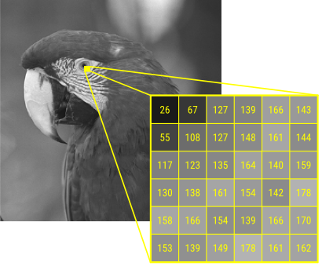
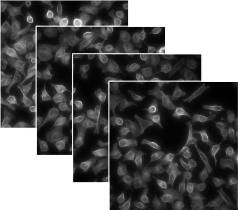
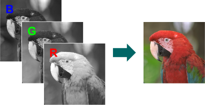
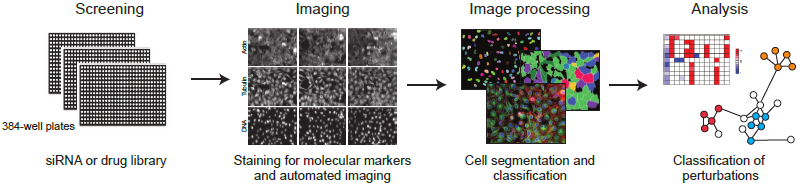

<style scoped>
ul > li:before {
    content: "•";
    color: #1a81c2;
    vertical-align: middle;
    font-family: "Arial Black";
    font-weight: 900;
    margin-left: -.85em;
}
</style>
```{r echo=FALSE, message=FALSE}
library(BioC2015Oles)
library(knitr)

opts_chunk$set(error=FALSE)
set.seed(7)
.dpi = 100
```


## Goals for this workshop

- Learn how to read and write images in and out of *R*

- Learn how images are represented in *R* and how to manipulate them

- Understand how to apply filters and transformations to images

- Apply these skills to microscopy images of cells to do segmentation and feature extraction

- Explore spatial distributions of the position of cells

## EBImage 

### Image processing and analysis toolbox for *R*

- Reading and writing of image files
- Interactive image viewer
- Image manipulation, transformation and filtering
- Object detection and feature extraction

<br/>

Since *Bioconductor* 1.8 (2006)

<table width="100%" style="font-size: 90%;">
<tr><td style="vertical-align: bottom;">
### Original developers:
Oleg Sklyar  
Wolfgang Huber  
Mike Smith  
Gregoire Pau  
</td><td style="vertical-align: bottom;">
### Contributors:
Joseph Barry  
Bernd Fischer  
Ilia Kats  
Philip A. Marais  
</td><td style="vertical-align: bottom;">

</td></tr>
</table>

## Let's get started!

```{r, message=FALSE, fig.width=768/.dpi, fig.height=512/.dpi, dpi=.dpi/2}
library(EBImage)

f = system.file("images", "sample.png", package="EBImage")
img = readImage(f)

display(img)
```

## Reading and displaying images

<div style="margin-top: -20px;"></div>

### Reading images

Images can be read from local files or URLs.

```{r, fig.width=480/.dpi, fig.height=138/.dpi, dpi=.dpi, eval=FALSE}
bioc = readImage("http://www.bioconductor.org/images/logo/jpg/bioconductor_logo_rgb.jpg")
display(bioc)
```

<table width="100%" style="font-size: 80%;">
<tr><td style="vertical-align: bottom;">

</td><td style="padding: 20px;">
*EBImage* supports JPEG, PNG and TIFF file formats.  
For reading proprietary microscopy image data and metadata use *[RBioFormats](https://github.com/aoles/RBioFormats)*.
</td></tr>
</table>

<div style="margin-top: 20px;"></div>

### Displaying images

- interactive JavaScript viewer
- *R*'s build-in plotting device

<font style="font-size: 90%;">The default `display` method can be set by `options(EBImage.display)`.</font>

```{r, eval=FALSE}
options(EBImage.display = "raster")
```

## Adding text labels

```{r, fig.width=dim(img)[1L]/.dpi, fig.height=dim(img)[2L]/.dpi, dpi=.dpi/2, results='hide'}
display(img, method = "raster")
text(x = 20, y = 20, label = "Parrots", adj = c(0,1), col = "orange", cex = 2)

filename = "parrots.jpg"
dev.print(jpeg, filename = filename , width = dim(img)[1], height = dim(img)[2])
```{r}
file.size(filename)
```

## Writing images

Supported file formats: JPEG, PNG and TIFF.

```{r}
writeImage(img, "sample.jpeg", quality = 85)

writeImage(img, "sample.tiff")
writeImage(img, "sample_compressed.tiff", compression = "deflate")

files = list.files(pattern = "sample*")
data.frame(row.names=files, size=file.size(files))
```

## Image representation

<table width="100%">
<tr><td style="vertical-align: top;">
Multi-dimensional pixel intensity arrays&nbsp;

- (x, y)   
- (x, y, **<font class=orange>z</font>**) z-stack
- (x, y, **<font class=orange>t</font>**) time-lapse
- (x, y, **<font class=orange>c</font>**) channels
- (x, y, c, z, t, ...)

</td><td>

</td></tr>
<tr><td style="vertical-align: top;">

</td><td>

</td></tr>
</table>

## Image representation

```{r}
str(img)
getClassDef("Image")
dim(img)
```

## Image summary

```{r}
img
imageData(img)[1:3, 1:6]
```

## Image histogram

```{r, fig.width=4, fig.height=4}
hist(img)
range(img)
```

## Color images

```{r, fig.width=dim(img)[1L]/.dpi, fig.height=dim(img)[2L]/.dpi, dpi=.dpi/2,}
f = system.file("images", "sample-color.png", package="EBImage")
imgcol = readImage(f)
display(imgcol)
print(imgcol, short = TRUE)
```

## Image stacks

```{r, echo=FALSE}
nuc = readImage(system.file("images", "nuclei.tif", package="EBImage"))
```{r, fig.width=dim(nuc)[1L]/.dpi, fig.height=dim(nuc)[2L]/.dpi, dpi=.dpi/2}
nuc = readImage(system.file("images", "nuclei.tif", package="EBImage"))
print(nuc, short = TRUE)
display(nuc)
```

## Image stacks

```{r, fig.width=dim(nuc)[1L]/.dpi, fig.height=dim(nuc)[2L]/.dpi, dpi=.dpi}
display(nuc, method = "raster", all = TRUE)
```

## Manipulating images

Being numeric arrays, images can be conveniently manipulated by any of *R*'s arithmetic operators.

### Cropping 

```{r, fig.width=384L/.dpi, fig.height=384L/.dpi, dpi=.dpi/2}
img = img[366:749, 58:441]
```

### Inversion

```{r negative, fig.width=dim(img)[1L]/.dpi, fig.height=dim(img)[2L]/.dpi, dpi=.dpi/2}
img_neg = max(img) - img
display(img_neg)
```

## Manipulating images

### Brightness, contrast, and gamma correction

```{r arithmetic, fig.width=(4*dim(img)[1L]+100)/.dpi, fig.height=(dim(img)[2L]+40)/.dpi, dpi=.dpi/2}
img_comb = combine(
  img,
  img + 0.3,
  img * 2,
  img ^ 0.5
)

display( tile(img_comb, numberOfFrames(img_comb), lwd = 20, fg.col = "white") )
```

## Tresholding images

### Binary images

Images which contain only two sets of pixels, which represent the background and the foreground pixels.

```{r, fig.width=dim(img)[1L]/.dpi, fig.height=dim(img)[2L]/.dpi, dpi=.dpi/2}
img_thresh = img > .5
display(img_thresh)
```

## Tresholding images

### Binary images

Images which contain only two sets of pixels, which represent the background and the foreground pixels.

```{r}
img_thresh
```

## Spatial transformations
### Translation

```{r translate, fig.width=dim(img)[1L]/.dpi, fig.height=dim(img)[2L]/.dpi, dpi=.dpi/2}
img_translate = translate(img, v = c(100, -50))
display(img_translate)
```

## Spatial transformations
### Rotation

```{r rotate-pre, echo=FALSE}
img_rotate = rotate(img, 30)
```{r rotate, fig.width=dim(img_rotate)[1L]/.dpi, fig.height=dim(img_rotate)[2L]/.dpi, dpi=.dpi/2}
img_rotate = rotate(img, angle = 30, bg.col = "white")
display(img_rotate)
```

## Spatial transformations
### Scaling

```{r resize, fig.width=512/.dpi, fig.height=256/.dpi, dpi=.dpi/2}
img_resize = resize(img, w = 512, h = 256)
display(img_resize)
```{r resize2, fig.width=256/.dpi, fig.height=256/.dpi, dpi=.dpi/2}
img_resize = resize(img, 256)
display(img_resize)
```

## Spatial transformations
### Vertical and horizontal reflection

```{r flipflop, fig.width=dim(img)[1L]/.dpi, fig.height=dim(img)[2L]/.dpi, dpi=.dpi/2}
display( flip(img) )
display( flop(img) )
```


## Affine transformation

Described by a 3x2 transformation matrix $\textbf{m}$

<div style="font-size:75%">
$$\begin{bmatrix} x'_1 & y'_1 \\
x'_2 & y'_2 \\
\vdots & \vdots \\
\end{bmatrix} =
\begin{bmatrix} x_1 & y_1 & 1 \\
x_2 & y_2 & 1 \\
\vdots & \vdots & \ddots \\
\end{bmatrix}
\times \textbf{m}$$
<br/>
$$\textbf{m}_{\text{translation}}=\begin{bmatrix} 1 & 0 \\ 0 & 1 \\ t_x & t_y \\ \end{bmatrix},\quad
\textbf{m}_{\text{rotation}}=\begin{bmatrix} \cos{\theta} & \sin{\theta} \\ -\sin{\theta} & \cos{\theta} \\ 0 & 0 \\ \end{bmatrix},\quad
\textbf{m}_{\text{scaling}}=\begin{bmatrix} W & 0 \\ 0 & H \\ 0 & 0 \\ \end{bmatrix}$$
</div>

## Affine transformation

<font class=blue>Example:</font> horizontal sheer mapping

```{r, fig.width=dim(img)[1L]/.dpi, fig.height=dim(img)[2L]/.dpi, dpi=.dpi/2}
angle = pi/6
m = matrix(c(1, -sin(angle), sin(angle)*dim(img)[2]/2, 0, 1, 0), nrow = 3, ncol = 2)
m
img_affine = affine(img, m)
display(img_affine)
```

## Image transposition

```{r transpose, fig.width=dim(imgcol)[2L]/.dpi, fig.height=dim(imgcol)[1L]/.dpi, dpi=.dpi/2}
imgcol_t = transpose(imgcol)
display(imgcol_t)
```

## Linear filters

<div style="margin-top: -20px;"></div>

### Removing local artifacts or noise -- average in a rectangular window

<div style="font-size:80%">
$$ f'(x,y) = \frac{1}{N} \sum_{s=-a}^{a}\sum_{t=-a}^{a} f(x+s, y+t),$$
where $f(x,y)$ is the value of the pixel at position $(x, y)$, $a$ determines the
window size, which is $2a+1$ in each direction.  $N=(2a+1)^2$ is the number of pixels
averaged over, and $f'$ is the new, smoothed image.
</div>

<div style="margin-top: 20px;"></div>

### Generalization: weighted average using a weight function $w$

<div style="font-size:80%">
$$ (w * f)(x,y) = \sum_{s=-\infty}^{+\infty} \sum_{t=-\infty}^{+\infty} w(s,t)\, f(x+s, y+s) $$

- convolution of the images $f$ and $w$, indicated by $*$
- linear: for any two images $f_1$, $f_2$ and numbers $c_1$, $c_2$ $$w*(c_1f_1+c_2f_2)=c_1w*f_1 + c_2w*f_2$$
</div>

## Generating the weight function

The weight function can be generated using `makeBrush`.

```{r, echo=FALSE}
opts_knit$set(global.par=TRUE)
```{r, echo=FALSE}
.par=par(mai = c(.45, .75, 0.05, 0.05))
```{r makeBrush, fig.width=3.8, fig.height=3.5, dev="svg", }
w = makeBrush(size = 31, shape = 'gaussian', sigma = 5)
plot(w[(nrow(w)+1)/2, ], ylab = "w", xlab = "")
```

Other available brush shapes: `"box"` (default), `"disc"`, `"diamond"`, `"line"`

## Low-pass filtering

2D linear convolution is implemented by `filter2` (uses FFT)

<font class=blue>Example:</font> Smoothing an image using a Gaussian filter of width 5

```{r, echo=FALSE}
opts_knit$set(global.par=FALSE)
```{r lopass, fig.width=dim(img)[1L]/.dpi, fig.height=dim(img)[2L]/.dpi, dpi=.dpi/2}
img_flo = filter2(img, w)
display(img_flo)
```

## High-pass filtering

Detecting edges and sharpening images

```{r highpass, fig.width=dim(img)[1L]/.dpi, fig.height=dim(img)[2L]/.dpi, dpi=.dpi/2}
fhi = matrix(1, nrow = 3, ncol = 3)
fhi[2, 2] = -8
fhi
img_fhi = filter2(img, fhi)
display(img_fhi)
```

## Adaptive tresholding

Compensate for spatial dependencies of the background signal

```{r, fig.width=(3*dim(nuc)[1L]+80)/.dpi, fig.height=(dim(nuc)[2L]+40)/.dpi, dpi=.dpi/2}
disc = makeBrush(21, "disc")
disc = disc / sum(disc)
nuc = getFrame(nuc, 1)
nuc_bg = filter2(nuc, disc)
offset = 0.02
nuc_thresh = (nuc - nuc_bg) > offset

img_comb = combine(nuc, nuc_bg, nuc_thresh)
display( tile(img_comb, numberOfFrames(img_comb), lwd = 20, fg.col = "white") )
```


## Median filter

Non-linear noise removal technique

- particularly effective in the case of speckle noise
- preserves edges

```{r medianFilter, fig.width=2*dim(img)[1L]/.dpi, fig.height=dim(img)[2L]/.dpi, dpi=.dpi/2, eval=TRUE}
l = length(img)
n = l/10
img_noisy = img
img_noisy[sample(l, n)] = runif(n, min = 0, max = 1)
img_median = medianFilter(img_noisy, size = 1)

display( combine(img_noisy, img_median), all=TRUE)
```

<div style="font-size:90%">Implemented using the constant time algorithm [@Perreault2007].</div>

## Morphological operations {.noiterpolation}

Non-linear filtering of binary images 

- <font class=blue>erosion:</font> for every <font class=orange>fg</font> pixel, put the mask around it, and if any pixel under the mask is from the <font class=orange>bg</font>, set all these pixels to <font class=orange>bg</font>.
- <font class=blue>dilation</font>: for every <font class=orange>bg</font> pixel, put the mask around it, and if any pixel under the mask is from the <font class=orange>fg</font>, set all these pixels to <font class=orange>fg</font>.

```{r echo=FALSE}
leaf = readImage( system.file('images', 'leaf.png', package='BioC2015Oles') )
.leafDim = BioC2015Oles:::tilesDim(dim(leaf), 3)
```{r, fig.width=.leafDim[1]/.dpi, fig.height=.leafDim[2]/.dpi, dpi=.dpi, out.width=2*.leafDim[1], results='hide'}
leaf = readImage( system.file('images', 'leaf.png', package='BioC2015Oles') )
kern = makeBrush(size = 3)
morph = combine(
  leaf,
  erode(leaf, kern),
  dilate(leaf, kern)
)

displayTiles(morph)
```

## Morphological operations {.noiterpolation}

- **<font class=blue>opening</font>:** erosion followed by dilation  
  removes small objects from the background
- **<font class=blue>closing</font>:** dilation followed by erosion  
  fills holes in the foreground

```{r, fig.width=.leafDim[1]/.dpi, fig.height=.leafDim[2]/.dpi, dpi=.dpi, out.width=2*.leafDim[1]}
morph = combine(
  leaf,
  opening(leaf, kern),
  closing(leaf, kern)
)

displayTiles(morph) 
```

## Application in cell biology

Fluorescent microscopy images from two channels of HeLa cells.

```{r}
dna = readImage(system.file("images", "nuclei.tif", package="EBImage"))
print(dna, short=TRUE)
tub = readImage(system.file("images", "cells.tif", package="EBImage"))
print(tub, short=TRUE)
```

## Application in cell biology
```{r, fig.width=2*dim(nuc)[1L]/.dpi, fig.height=dim(nuc)[2L]/.dpi, dpi=.dpi/3}
display( combine(getFrame(dna, 3), getFrame(tub, 3)), all=TRUE )
```{r, fig.width=BioC2015Oles:::tilesDim(dim(dna), numberOfFrames(dna))[1L]/.dpi, fig.height=BioC2015Oles:::tilesDim(dim(dna), numberOfFrames(dna))[2L]/.dpi, dpi=.dpi/3}
rgb = rgbImage(green = 1.5 * tub, blue = dna)
displayTiles(rgb)
```

## Nuclei segmentation

- Adaptive thresholding of the DNA channel
- Morphological opening and filling of holes
- Distance map computation and watershed transformation
  
### Adaptive thresholding and morphological filtering
  
```{r, fig.width=2*dim(nuc)[1L]/.dpi, fig.height=dim(nuc)[2L]/.dpi, dpi=.dpi/2}
nmaskt = thresh(dna, w = 15, h = 15, offset = 0.05)
nmaskf = fillHull( opening(nmaskt, makeBrush(5, shape='disc')) )

display( combine(getFrame(nmaskt, 3), getFrame(nmaskf, 3)), all=TRUE )
```

## Nuclei segmentation

### Distance map computation
  
```{r, fig.width=dim(nuc)[1L]/.dpi, fig.height=dim(nuc)[2L]/.dpi, dpi=.dpi/2}
dmap = distmap(nmaskf)
range(dmap)

display(normalize(dmap), frame = 3)
```

## Nuclei segmentation

### Watershed transformation

```{r, fig.width=2*dim(nuc)[1L]/.dpi, fig.height=dim(nuc)[2L]/.dpi, dpi=.dpi/2}
nmask = watershed(dmap, tolerance = 2)

display( combine(
  toRGB( getFrame(dna, 3) ), 
  colorLabels( getFrame(nmask, 3) )
), all=TRUE )
```

`bwlabel` - a simpler and faster function for segmenting connected objects

## Cytoplasm segmentation

Identification of cell bodies by Voronoi partitioning using the segmented nuclei as seeds.

```{r, fig.width=2*dim(nuc)[1L]/.dpi, fig.height=dim(nuc)[2L]/.dpi, dpi=.dpi/2}
cmaskt = closing( gblur(tub, 1) > 0.105, makeBrush(5, shape='disc') )

cmask  = propagate(tub, seeds=nmask, mask=cmaskt, lambda = 0.001)

display( combine(
  toRGB( getFrame(cmaskt, 3) ), 
  colorLabels( getFrame(cmask, 3) )
), all=TRUE )
```

## Voronoi tesselation

Voronoi diagram is a partitioning of a plane into regions based on distance to some specific points of that plane (seeds).
      
### Voronoi tesselation on a Riemann manifold

- arbitrary shape (provided in `mask`)
- arbitrary metric (dependent on image gradient $z$)

<div style="font-size: 90%">

Distance between points $(x, y, z)$ and $(x+dx, y+dy, z+dz)$
<font style="font-size: 90%">
$$
ds = \sqrt{ \frac{2}{\lambda+1} \left[ \lambda \left( dx^2 + dy^2 \right) + dz^2 \right] }
$$
</font>
$\lambda$ controls the weight of the Euclidean distance term

- when $\lambda$ is large, $ds$ tends to the Euclidean distance
- for small $\lambda$, $ds$ tends to the intensity gradient of the image
</div>

## Final segmentation

```{r, fig.width=2*dim(nuc)[1L]/.dpi, fig.height=2*dim(nuc)[2L]/.dpi, dpi=.dpi/2}
display( paintObjects(nmask,
            paintObjects(cmask, rgb, col = "magenta", thick = TRUE),
         col = "yellow", thick = TRUE), all = TRUE)
```

## Individual cells stacked

```{r, fig.width=2*dim(nuc)[1L]/.dpi, fig.height=2*dim(nuc)[2L]/.dpi, dpi=.dpi/2, eval=TRUE}
st = stackObjects(cmask, rgb)

display(st, all = TRUE)
```

## Feature extraction

Quantitative cellular descriptors

- basic statistics on pixel intensities `computeFeatures.basic`
- shape characteristics (area, perimeter, radius) `computeFeatures.shape`
- moments (center of mass,  eccentricity, ...) `computeFeatures.moment`
- Haralick textural features `computeFeatures.haralick`

```{r}
head( computeFeatures.shape(cmask[,,1], tub[,,1]) )
```

## Automated cellular phenotyping

Using multivariate analysis methods we can:

- detect cell subpopulations (clustering)
- classify cells into pre-defined cell types or phenotypes (classification)
- based on the frequencies of the subpopulations compare different biological conditions

<br/>

<div class="centered"></div>

# Spatial statistics: point processes 

## Interaction between immune and cancer cells 

Lymph nodes

- immunologic filter composed of B cells, T cells, dendric cells (DC) and macrophages
- clinical significance in cancer staging (the *sentinel* lymph node)

<table style="border-spacing: 30px; border-collapse: separate;">
<tr><td>
```{r, echo=FALSE}
.lymphnode = readImage( system.file("images", "testscan_1_2_RGB99-4525D.jpg", package = "BioC2015Oles") )
```{r, echo=FALSE, fig.width=dim(.lymphnode)[1L]/(4*.dpi), fig.height=dim(.lymphnode)[2L]/(4*.dpi), dpi=.dpi}
display(.lymphnode)
```
</td><td style="vertical-align: bottom">
<div style="font-size:80%">
Breast cancer lymph node biopsy [@Setiadi2010].

Cell typing was done by staining the cells with protein antibodies that provide specific signatures.
</div>
</td></tr>
</table>

## Lymph node biopsies

```{r}
data(brcalymphnode, package = "BioC2015Oles")
head(brcalymphnode)
nrow(brcalymphnode)
table(brcalymphnode$class)
```

## Spatial distribution of cells

Plot of the *x* and *y* positions of the T cells (left) and tumor cells (right)

```{r, fig.width=7, fig.height=3.5}
par(mfrow = c(1, 2), mar = c(4.5, 4.5, 0.5, 0.5))
xlim = range(brcalymphnode$x)
ylim = range(brcalymphnode$y)
cols = c(`T_cells` = "dodgerblue4", `Tumor` = "darkmagenta")
for(i in seq_along(cols))
  plot(subset(brcalymphnode, class==names(cols)[i])[, c("x", "y")], 
       pch = ".", asp = 1, xlim = xlim, ylim = ylim, col = cols[i])
```

## Analysis of spatial point patterns

Marked spatial point process:

- set of isolated points located in a mathematical space (`xlim`, `ylim`)
- points marked with certain properties (factor `class`)


```{r, message=FALSE}
library("spatstat")

ln = with(brcalymphnode, 
  ppp(x = x, y = y, marks = class, xrange = xlim, yrange = ylim)
)

ln
```

## Convex hull

```{r, fig.width=2, fig.height=2}
chull = convexhull(ln)

par(mar = c(0, 0, 0, 0))
plot(Window(ln), main = NULL, asp = 1)
plot(chull, lty = 2, col = "lightblue", add = TRUE)
Window(ln) = chull
ln
```

## First order effects: the intensity

- Number of points lying in a circle of area $a$ around a point $p=(x,y)$
<font style="font-size: 90%">$$N(p, a)$$</font>

- Local intensity
<font style="font-size: 90%">$$\lambda(p) = \lim_{a\rightarrow 0} \frac{E[ N(p, a)]}{a}$$</font>

- For a *stationary* process, i.e., homogeneous all over the region
<font style="font-size: 90%">$$\lambda(p) = \text{const.}$$</font>
Then the intensity in an area $A$ is proportional to the area
<font style="font-size: 90%">$$E(N(\cdot, A)) = \lambda A$$</font>

## Estimating the intensity

Kernel smoothed intensity estimate of a point pattern [@Diggle1985]
<div style="font-size:90%">
$$\hat{\lambda}(p) = \sum_i e(p_i) K(p-p_i)$$
where $K$ is the Gaussian smoothing kernel, and $e(p_i)$ is an edge correction factor.
</div>

```{r density.ppp1, fig.width=5.25, fig.height=2.65}
densities = solist( 
  `Diggle's edge correction` = density(subset(ln, marks=="Tumor"), diggle = TRUE),
  `No edge correction`       = density(subset(ln, marks=="Tumor"), edge = FALSE)
)
plot(densities, equal.ribbon = TRUE, col = topo.colors, main = "")
```

## Probability of cell classes

Estimate of the spatially-varying probability of a particular event type

```{r, fig.width=9.5, fig.height=2.8}
rr = relrisk(ln, sigma = 250)

plot(rr, equal.ribbon = TRUE, col = topo.colors, nrows = 1, main = "")
```

## Second order effects: clustering

Spatial clustering (or anticlustering) of points: whether and to what extent neighboring points are more/less dense than expected by chance.

### Poisson process

<div style="font-size: 90%;">
- stationary with intensity $\lambda$
- no dependency between occurrences of objects in non-overlapping regions
- $N(p, A)$ follows a Poisson distribution with rate $\lambda A$
</div>

### The nearest neighbour (NN) distance distribution function $G$

Cumulative distribution function of the distance $W$ from a typical random point to its nearest neighbor. For a Poisson process

<font style="font-size:90%">$$G(r) = P(W \leq r) = 1-e^{-\lambda \pi r^2}$$</font>

## Estimation of the NN distance function *G*

```{r Gest}
gln = Gest(ln)
gln
```   

## Estimation of the NN distance function *G*

```{r, fig.width=4, fig.height=4, message=FALSE}
library(RColorBrewer)
par(mar = c(4.5, 4.5, 0.5, 0.5))

plot(gln, lty = 1, col = brewer.pal(4, "Set1"), main = "")
```

<div style="font-size: 90%;">
- effect of finite cell size
- clustering at large distances
</div>

## Ripley's *K*-function

For a stationary point process $\lambda K(r)$ is the expected number of 
additional points within a distance $r$ of a given, randomly picked point. 

### Generalization to inhomogenous point processes

<div style="font-size:90%">
<font style="font-size: 90%">$$K_{\text{inhom}}(r) = \sum_{i,j} {\mathbf 1}_{d(p_i, p_j) \le r} \times \frac{e(p_i, p_j, r)} { \lambda(x_i)  \lambda(x_j) },$$</font>
</div>
where $d(p_i, p_j)$ is the distance between points $p_i$ and $p_j$, and 
$e(p_i, p_j, r)$ is an edge correction factor.

More useful for estimation and visualization is the $L$-function
<div style="font-size:90%">
<font style="font-size: 90%">$$L(r)=\sqrt{\frac{K(r)}{\pi}}.$$</font>
</div>
For a Poisson point pattern, the theoretical value is $L(r) = r$. 

## Estimate of the inhomogeneous *L*-function

```{r, eval=FALSE}
Lln = Linhom( subset(ln, marks=="T_cells") )
Lln
```{r, echo=FALSE}
data(Lln, package = "BioC2015Oles")
Lln
```

## Estimate of the inhomogeneous *L*-function

```{r, fig.width=4.5, fig.height=4.5}
par(mar = c(4.5, 4.5, 0.5, 0.5))

plot(Lln, lty = 1, col = brewer.pal(3, "Set1"), main = "")
```   

## Pair correlation function

Describes how point density varies as a function of distance from a reference point.
<div style="font-size:90%">
$$g(r)=\frac{1}{2\pi r}\frac{dK}{dr}(r)$$
</div>
For a stationary Poisson process $g(r) = 1$. 

<div style="font-size: 90%;">
- $g(r) < 1$ -- inhibition between points
- $g(r) > 1$ -- clustering
</div>

## Pair correlation function

```{r, eval=FALSE}
pcfln = pcf( Kinhom(subset(ln, marks=="T_cells")) )

plot(pcfln, lty = 1, log = "x")
```{r, fig.width=4.5, fig.height=4.5, echo=FALSE}
par(mar = c(4.5, 4.5, 0.5, 0.5))

data(pcfln, package = "BioC2015Oles")
plot(pcfln, lty = 1, log = "x", main = "")
```

## References {.smaller}

