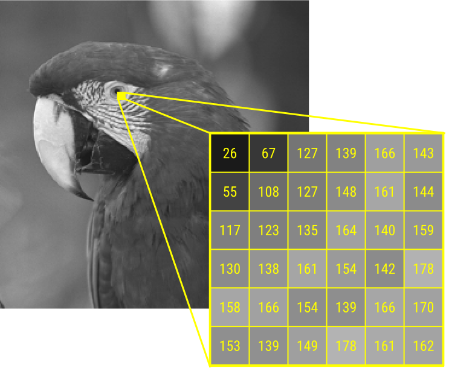
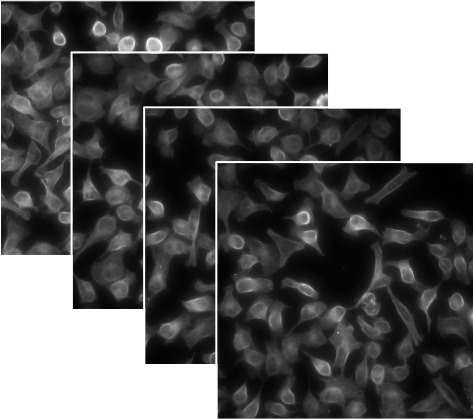
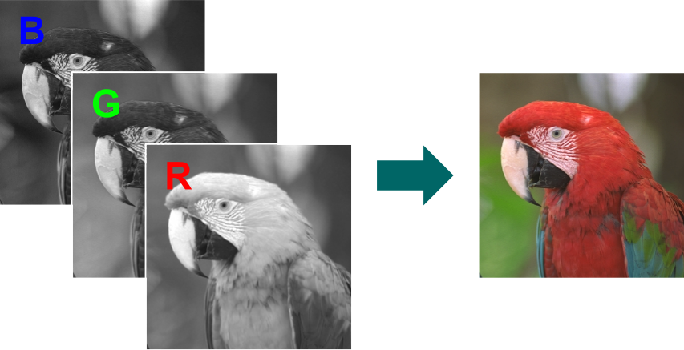

```{r echo=FALSE, message=FALSE}
library(EBImage)
f = system.file("images", "sample.png", package="EBImage")
img = readImage(f)
.dim = dim(img)
.dpi = 100

library(knitr)
opts_chunk$set(error=FALSE)
```

## EBImage

Image processing and analysis toolbox for *R*

- Reading and writing of image files
- Interactive image viewer
- Image manipulation, transformation and filtering
- Object detection and feature extraction

Since *Bioconductor* 1.8 (2006)


<table width="80%" style="font-size: 80%">
<tr><td>
<h3>Original developers:</h3>
Oleg Sklyar<br/>
Wolfgang Huber<br/>
Mike Smith<br/>
Gregoire Pau
</td><td>
<h3>Contributors:</h3>
Joseph Barry<br/>
Bernd Fischer<br/>
Ilia Kats<br/>
Philip A. Marais<br/>
</td></tr>
</table>

## Let's get started!

```{r, fig.width=dim(img)[1L]/.dpi, fig.height=dim(img)[2L]/.dpi, dpi=.dpi/2}
library(EBImage)

f = system.file("images", "sample.png", package="EBImage")
img = readImage(f)

display(img)
```

## Reading and displaying images

### Reading images

Images can be read from local files or URLs

```{r, fig.width=480/.dpi, fig.height=138/.dpi, dpi=.dpi, eval=FALSE}
bioc = readImage("http://www.bioconductor.org/images/logo/jpg/bioconductor_logo_rgb.jpg")
display(bioc)
```

### Displaying images

- using an intearactive JavaScript viewer
- on R's build-in raster device

To set the default `display` method use `options(EBImage.display)`

```{r, eval=FALSE}
options(EBImage.display = "raster")
```

## Adding text labels

```{r, fig.width=dim(img)[1L]/.dpi, fig.height=dim(img)[2L]/.dpi, dpi=.dpi/2, results='hide'}
display(img, method = "raster")
text(x = 20, y = 20, label = "Parrots", adj = c(0,1), col = "orange", cex = 2)

filename = "parrots.jpg"
dev.print(jpeg, filename = filename , width = dim(img)[1], height = dim(img)[2])
```{r}
file.info(filename)$size
```

## Writing images

Supported file formats: JPEG, PNG and TIFF.

```{r}
writeImage(img, "sample.jpeg", quality = 85)

writeImage(img, "sample.tiff")
writeImage(img, "sample_compressed.tiff", compression = "deflate")

files = list.files(pattern = "sample*")
data.frame(row.names=files, size=file.size(files))
```

## Image representation

<table width="100%">
<tr><td style="vertical-align: top;">
Multi-dimensional pixel intensity arrays

<div style="font-size:75%">
- (x, y)   
- (x, y, **z**}) z-stack
- (x, y, **t**) time-lapse
- (x, y, **c**) channels
- (x, y, c, z, t, ...)
</div>

</td><td>
<div style="width:360px;"></div>
</td></tr>
<tr><td style="vertical-align: top;">
<div style="width:250px;"></div>
</td><td>

</td></tr>
</table>

## Image representation

```{r}
str(img)
dim(img)
imageData(img)[1:3, 1:6]
```

## Image summary

```{r}
img
```

## Image histogram

```{r, fig.width=5, fig.height=5}
hist(img)
```

## Color images

```{r, fig.width=dim(img)[1L]/.dpi, fig.height=dim(img)[2L]/.dpi, dpi=.dpi/2,}
f = system.file("images", "sample-color.png", package="EBImage")
imgcol = readImage(f)
display(imgcol)
print(imgcol, short = TRUE)
```

## Image stacks

```{r, echo=FALSE}
nuc = readImage(system.file("images", "nuclei.tif", package="EBImage"))
```{r, fig.width=dim(nuc)[1L]/.dpi, fig.height=dim(nuc)[2L]/.dpi, dpi=.dpi/2}
nuc = readImage(system.file("images", "nuclei.tif", package="EBImage"))
print(nuc, short = TRUE)
display(nuc)
```

## Image stacks

```{r, fig.width=dim(nuc)[1L]/.dpi, fig.height=dim(nuc)[2L]/.dpi, dpi=.dpi}
display(nuc, method = "raster", all = TRUE)
```

## Manipulating images

Being numeric arrays, images can be conveniently manipulated by any of R's arithmetic operators.

### Cropping 

```{r fig.width=384L/.dpi, fig.height=384L/.dpi, dpi=.dpi/2}
img = img[366:749, 58:441]
```

### Inversion

```{r negative, fig.width=dim(img)[1L]/.dpi, fig.height=dim(img)[2L]/.dpi, dpi=.dpi/2}
img_neg = max(img) - img
display( img_neg )
```

## Manipulating images

### Brightness, contrast, and gamma correction

```{r arithmetic, fig.width=4*dim(img)[1L]/.dpi, fig.height=dim(img)[2L]/.dpi, dpi=.dpi/2}
img_comb = combine(
  img,
  img + 0.3,
  img * 2,
  img ^ 0.5
)

display( tile(img_comb, numberOfFrames(img_comb), lwd=10, fg.col = "white") )
```

## Binary images

Images which contain only two sets of pixels representing the background and foreground pixels.

```{r, fig.width=dim(img)[1L]/.dpi, fig.height=dim(img)[2L]/.dpi, dpi=.dpi/2}
( img_thresh = img > .5 )
display( img_thresh )

```

## Spatial transformations
### Translation

```{r translate, fig.width=dim(img)[1L]/.dpi, fig.height=dim(img)[2L]/.dpi, dpi=.dpi/2}
img_translate = translate(img, c(100,-50))
display(img_translate)
```

## Spatial transformations
### Rotation

```{r rotate-pre, echo=FALSE}
img_rotate = rotate(img, 30, bg.col = "white")
```{r rotate, eval=FALSE}
img_rotate = rotate(img, 30, bg.col = "white")
display(img_rotate)
```{r rotate-post, echo=FALSE, fig.width=dim(img_rotate)[1L]/.dpi, fig.height=dim(img_rotate)[2L]/.dpi, dpi=.dpi/2}
display(img_rotate)
```

## Spatial transformations
### Scaling

```{r resize, fig.width=512/.dpi, fig.height=256/.dpi, dpi=.dpi/2}
img_resize = resize(img, w=512, h=256)
display(img_resize)
```{r resize2, fig.width=256/.dpi, fig.height=256/.dpi, dpi=.dpi/2}
img_resize = resize(img, 256)
display(img_resize)
```

## Spatial transformations
### Vertical and horizontal reflection

```{r flipflop, fig.width=dim(img)[1L]/.dpi, fig.height=dim(img)[2L]/.dpi, dpi=.dpi/2}
display( flip(img) )
display( flop(img) )
```


## Affine transformation

Described by a 3x2 transformation matrix $\textbf{m}$

<div style="font-size:75%">
$$\begin{bmatrix} x'_1 & y'_1 \\
x'_2 & y'_2 \\
\vdots & \vdots \\
\end{bmatrix} =
\begin{bmatrix} x_1 & y_1 & 1 \\
x_2 & y_2 & 1 \\
\vdots & \vdots & \ddots \\
\end{bmatrix}
\times \textbf{m}$$
<br/>
$$\textbf{m}_{\text{translation}}=\begin{bmatrix} 1 & 0 \\ 0 & 1 \\ t_x & t_y \\ \end{bmatrix},\quad
\textbf{m}_{\text{rotation}}=\begin{bmatrix} \cos{\theta} & \sin{\theta} \\ -\sin{\theta} & \cos{\theta} \\ 0 & 0 \\ \end{bmatrix},\quad
\textbf{m}_{\text{scaling}}=\begin{bmatrix} W & 0 \\ 0 & H \\ 0 & 0 \\ \end{bmatrix}$$
</div>

## Affine transformation

Example: horizontal sheer mapping

```{r, fig.width=dim(img)[1L]/.dpi, fig.height=dim(img)[2L]/.dpi, dpi=.dpi/2}
m =  matrix(c(1, -.5, 128, 0, 1, 0), nrow=3, ncol=2)
m
img_affine = affine(img, m)
display( img_affine )
```

## Image transposition

```{r transpose, fig.width=dim(imgcol)[2L]/.dpi, fig.height=dim(imgcol)[1L]/.dpi, dpi=.dpi/2}
imgcol_t = transpose(imgcol)
display( imgcol_t )
```

## Linear filters

Cleaning up local artifacts or noise through smoothing.

<div style="font-size:80%">
$$
f'(x,y) = \frac{1}{N} \sum_{s=-a}^{a}\sum_{t=-a}^{a} f(x+s, y+t),
$$
where $f(x,y)$ is the value of the pixel at position $(x, y)$, $a$ determines the
window size, which is $2a+1$ in each direction.  $N=(2a+1)^2$ is the number of pixels
averaged over, and $f'$ is the new, smoothed image.

### Generalization: weighted average using a weight function $w$
$$
(w * f)(x,y) = \sum_{s=-\infty}^{+\infty} \sum_{t=-\infty}^{+\infty} w(s,t)\, f(x+s, y+s)
$$

 - convolution of the images $f$ and $w$, indicated by $*$.
 - linear: for any two images $f_1$, $f_2$ and numbers $c_1$, $c_2$. we have $$w*(c_1f_1+c_2f_2)=c_1w*f_1 + c_2w*f_2$$
</div>

## Generating the weight function

The weight function can be generated using `makeBrush`.

```{r, echo=FALSE}
opts_knit$set(global.par=TRUE)
```{r, echo=FALSE}
.par=par(mai = c(.45, .75, 0.05, 0.05))
```{r makeBrush, fig.width=3.8, fig.height=3.5, dev="svg", }
w = makeBrush(size = 31, shape = 'gaussian', sigma = 5)
plot(w[(nrow(w)+1)/2, ], ylab = "w", xlab = "")
```

Other available brush shapes: `"box` (default), `"disc"`, `"diamond"`, `"line"`


## Low-pass filtering

2D linear convolution is implemented by `filter2` (uses FFT).

Smoothening the image using a Gaussian filter of width 5.

```{r, echo=FALSE}
opts_knit$set(global.par=FALSE)
```{r lopass, fig.width=dim(img)[1L]/.dpi, fig.height=dim(img)[2L]/.dpi, dpi=.dpi/2}
img_flo = filter2(img, w)
display(img_flo)
```

## High-pass filtering

Detecting edges and sharpening images.

```{r highpass, fig.width=dim(img)[1L]/.dpi, fig.height=dim(img)[2L]/.dpi, dpi=.dpi/2}
fhi = matrix(1, nrow = 3, ncol = 3)
fhi[2, 2] = -8
img_fhi = filter2(img, fhi)
display(img_fhi)
```

## Median filter

Non-linear noise removal technique

- particularly effective in the case of speckle noise
- preserves edges

```{r medianFilter, fig.width=2*dim(img)[1L]/.dpi, fig.height=dim(img)[2L]/.dpi, dpi=.dpi/2, eval=FALSE}
l = length(img)
n = l/10
img_noisy = img
img_noisy[sample(l, n)] = runif(n, min=0, max=1)
img_median = medianFilter(img_noisy, size = 1)

display( combine(img_noisy, img_median), all=TRUE)
```

<div style="font-size:80%">Implemented using the constant time algorithm [@Perreault2007].</div>


## Morphological operations | Non linear filtering of binary images 

<span class=orange>erosion</span>/<span class=blue>dilation</span>: for every fg/bg pixel, put the mask around it, and if any pixel under the mask is from the bg/fg, set all these pixels to bg/fg.


```{r, fig.width=(3*56+4*5)/.dpi, fig.height=(56+2*5)/.dpi, dpi=.dpi, out.width=2*(3*56+4*5)}
leaf = readImage( system.file('images', 'leaf.png', package='BioC2015Oles') )
kern = makeBrush(size = 3, shape = "disc")
morph = combine(
  leaf,
  erode(leaf, kern),
  dilate(leaf, kern) )

display( tile(morph, nx = numberOfFrames(morph), lwd = 5, fg.col = "white") ) 
```

## Morphological operations

- **<font class=blue>opening</font>:** erosion followed by dilation  
  removes small objects from the background

- **<font class=blue>closing</font>:** dilation followed by erosion  
  fills holes in the foreground

```{r, fig.width=(3*56+4*5)/.dpi, fig.height=(56+2*5)/.dpi, dpi=.dpi, out.width=2*(3*56+4*5)}
morph = combine(
  leaf,
  opening(leaf, kern),
  closing(leaf, kern) )

display( tile(morph, nx = numberOfFrames(morph), lwd = 5, fg.col = "white") ) 
```


##

Furthermore, we can crop and threshold images with standard matrix operations.

```{r}
img_thresh = img > .5
display(img_thresh)
```{r cropthreshold-post, echo=FALSE, fig.width=dim(img_thresh)[1L]/.dpi, fig.height=dim(img_thresh)[2L]/.dpi, dpi=.dpi/2}
display(img_thresh)
```

Thresholding returns an `Image` object with binarized pixels values. 
```{r img_thresh}
img_thresh
```

## References